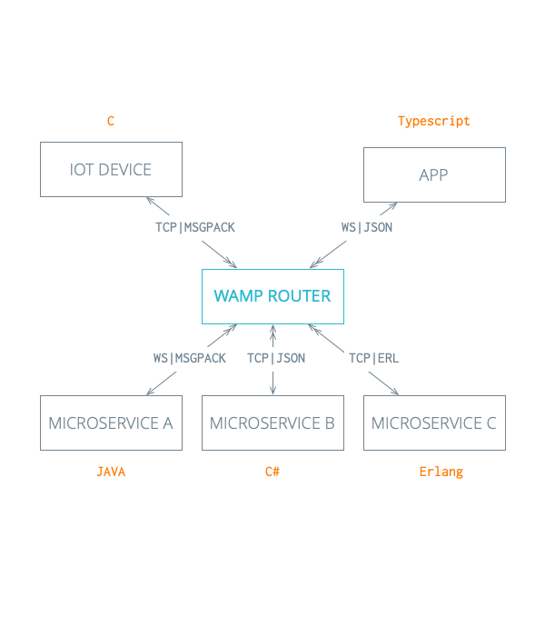

# What is Bondy

> ### Bondy is an open source, distributed, scalable networking platform for microservices and Internet Of Things applications written in Erlang. It implements the open Web Application Messaging Protocol \(WAMP\) offering both PubSub and Routed RPC.

## WAMP Router

As opposed to other API management solutions, Bondy unifies Remote Procedure Call \(RPC\) and Publish-Subscribe messaging patterns over multiple transports under a single layer, implementing the open [Web Application Messaging Protocol \(WAMP\)](../using/introduction_to_wamp/).

Because it implements WAMP, Bondy enables **loosely coupled application components** \(embedded software, µServices, mobile and web applications\) to communicate in **\(soft\) real-time**.

Bondy enables a **polyglot architecture**. Bondy  routes messages between those application components, which can be written in any language as long as they use a compliant [WAMP client](https://crossbar.io/docs/Getting-Started/#wamp-clients).

## How is Bondy different than other WAMP routers?

Bondy provides a unique sets of features which sets it apart from other WAMP router implementations in terms of _scalability, reliability, high-performance and operational simplicity_.

* **Distributed by design** – ****As opposed to existing WAMP Router implementations, Bondy was designed as a reliable distributed router, ensuring continued operation in the event of node or network failures through clustering and data replication. 
* **Scalability** – Bondy is written in Erlang/OTP which provides the underlying operating system to handle concurrency and scalability requirements, allowing Bondy to scale to thousands and even millions of concurrent connections on a single node. Its distributed architecture also allows for horizontal scaling by simply adding nodes to the cluster.
* **Peer-to-peer master-less clustering** – All nodes in a Bondy cluster are equal, thanks to the underlying clustering and networking technology which provides a master-less architecture.
* **Low latency data replication** – All nodes in a Bondy cluster share a global state which is replicated through a highly scaleable and low latency eventually consistency model based on gossip. Bondy uses [Partisan](http://partisan.cloud), a high-performance Distributed Erlang replacement that enables various network topologies and supports large clusters \(Partisan has been demonstrated to scale up to 1,024 Erlang nodes, and provide better scalability and reduced latency than Distributed Erlang\). 
* **Ease of use** – Bondy is easy to operate due to its operational simplicity provided by its peer-to-peer nature and the lack of special nodes, the automatic data replication and self-healing.
* **Embedded REST API Gateway** – Bondy embeds a powerful API Gateway that can translate HTTP REST actions to WAMP RPC and PubSub operations. The API Gateway leverages the underlying storage and replication technology to deploy the API Specifications to the cluster nodes in real-time.
* **Embedded Broker Bridge** – Bondy embeds a Broker Bridge that can manage a set of WAMP subscribers that re-publish WAMP events to an external non-WAMP system e.g. a message broker.
* **Embedded Role-based Access Control \(RBAC\)** – Bondy embeds a RBAC subsystem to empower the per realm API Gateway, OAuth2 and WAMP security features. It borrows its design and implementation from Riak Core's Security subsystem which itself was modelled after PostgreSQL RBAC.

